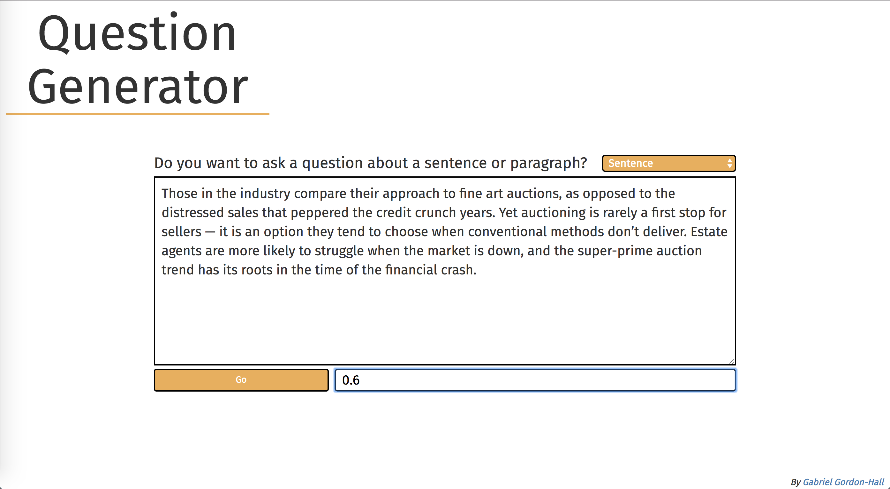
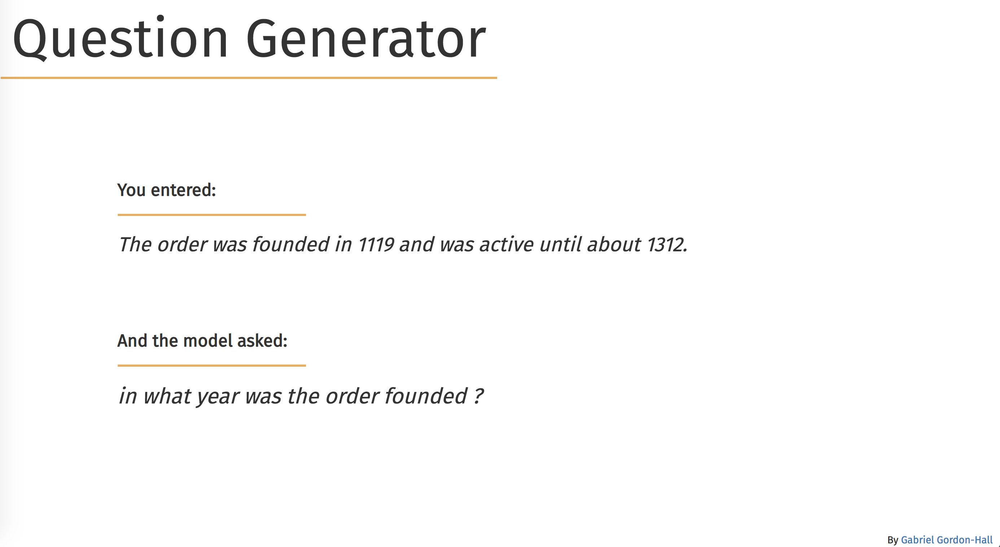

# Question Generator
## Ask questions of text with a trained neural network. 

Both sentence and paragraph-level models can be run. Both  are [Pointer-Generator](https://arxiv.org/abs/1704.04368) networks (See et al. 2017) trained on the SQuAD dataset.

The models are trained with the excellent [OpenNMT-py](https://github.com/OpenNMT/OpenNMT-py) sequence-to-sequence library. Decoding uses the [Diverse Beam Search](https://arxiv.org/abs/1610.02424) algorithm (Vijayakumar et al. 2016). You can tune the diversity strength, δ (it must be between 0 and 1).  

Sadly the models are not the brightest - go easy on them - linguistic understanding with neural networks has a long way to go! 

Install the dependencies and run `application.py` to get started!

